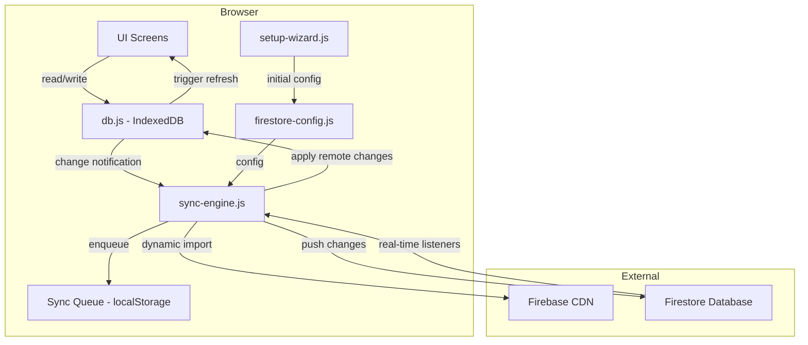
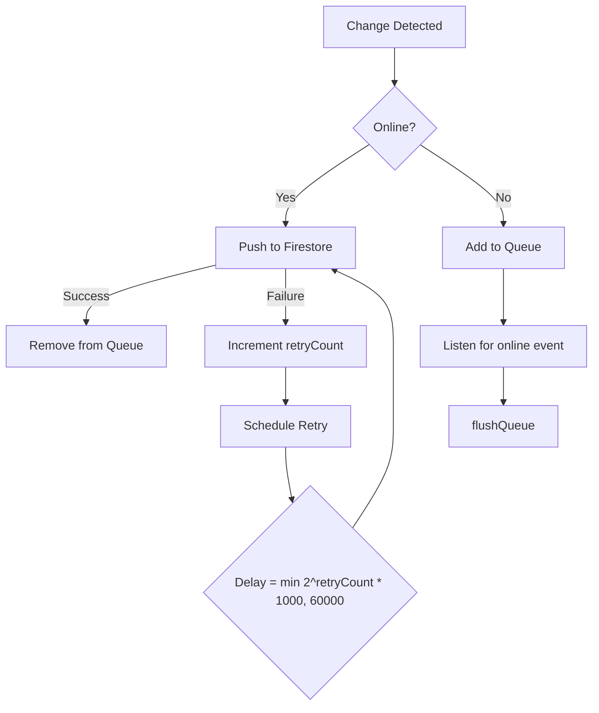
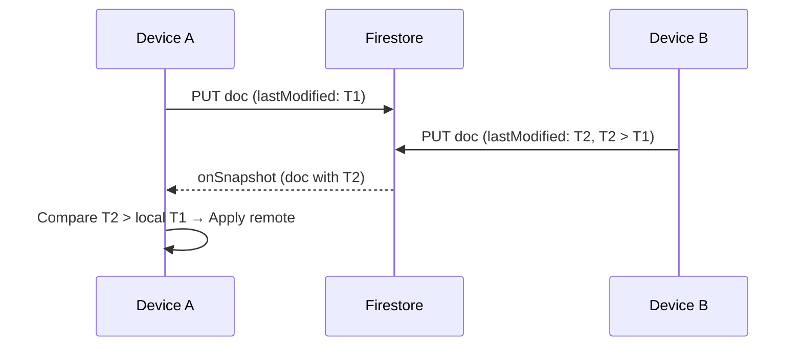

# Design Document: Firestore Sync Setup

## Overview

This design adds configurable Firestore cloud sync to the Track Your Fitness PWA. The architecture follows an offline-first pattern where IndexedDB remains the primary data store and Firestore acts as a sync backend. Three new JS modules are introduced — `firestore-config.js`, `sync-engine.js`, and `setup-wizard.js` — all following the existing IIFE pattern. Firebase SDK is loaded dynamically from CDN only when sync is enabled, keeping the initial bundle size unchanged.

The sync engine intercepts all IndexedDB write operations (via a thin wrapper layer in `db.js`) and queues changes for upstream push. Simultaneously, Firestore real-time listeners propagate remote changes to the local store with last-writer-wins conflict resolution based on `_lastModified` timestamps.

## Architecture

### High-Level Architecture Diagram



### Module Dependency Order

```
utils.js → qrcode-lib.js → license.js → db.js → settings.js →
firestore-config.js → sync-engine.js → setup-wizard.js →
whatsapp.js → members.js → ... → backup.js → app.js
```

The three new modules load after `settings.js` (which manages localStorage) and before the feature modules that perform data writes.

### Data Flow

**Local Write → Remote Sync:**
1. UI module calls `DB.addMember(m)` (or any write operation)
2. `db.js` executes the IndexedDB operation
3. `db.js` notifies `SyncEngine` of the change (store name, record, operation type)
4. `SyncEngine` adds the change to the localStorage-based sync queue
5. If online and connected, `SyncEngine` flushes the queue to Firestore
6. On success, the queue entry is removed

**Remote Change → Local Apply:**
1. Firestore real-time listener receives a document change
2. `SyncEngine` compares remote `_lastModified` with local record timestamp
3. If remote is newer (or record doesn't exist locally), applies to IndexedDB
4. `SyncEngine` dispatches a custom event `tyf-sync-update` on `document`
5. `App.refreshScreenData()` re-renders the active screen

## Components and Interfaces

### 1. FirestoreConfig Module (`js/firestore-config.js`)

Manages storage and retrieval of Firestore configuration.

```javascript
const FirestoreConfig = (function () {
  'use strict';

  const PREFIX = 'tyf_firestore_';
  const FIELDS = ['apiKey', 'authDomain', 'projectId', 'storageBucket',
                  'messagingSenderId', 'appId'];
  const COLLECTION_KEY = PREFIX + 'collection';
  const SYNC_ENABLED_KEY = PREFIX + 'sync_enabled';
  const WIZARD_SKIPPED_KEY = PREFIX + 'wizard_skipped';

  // Public API
  return {
    getConfig,        // () → { apiKey, authDomain, projectId, ... } | null
    setConfig,        // (configObj) → void
    getCollectionName, // () → string | null
    setCollectionName, // (name) → void
    isSyncEnabled,    // () → boolean
    setSyncEnabled,   // (bool) → void
    isWizardSkipped,  // () → boolean
    setWizardSkipped, // (bool) → void
    hasConfig,        // () → boolean (true if mandatory fields present)
    validate,         // (configObj, collectionName) → { valid, errors[] }
    clear             // () → void (removes all firestore keys)
  };
})();
```

**Validation Rules:**
- `collectionName`: 1–50 characters, regex `/^[a-zA-Z0-9_-]{1,50}$/`
- `apiKey`: non-empty string (mandatory)
- `projectId`: non-empty string (mandatory)
- `appId`: non-empty string (mandatory)
- `authDomain`, `storageBucket`, `messagingSenderId`: optional strings

### 2. SyncEngine Module (`js/sync-engine.js`)

Handles bidirectional synchronization between IndexedDB and Firestore.

```javascript
const SyncEngine = (function () {
  'use strict';

  const SYNCED_STORES = ['members', 'contributions', 'payments',
                         'expenses', 'guest_sessions', 'monthly_fee_records'];
  const QUEUE_KEY = 'tyf_sync_queue';
  const RETRY_INITIAL_MS = 1000;
  const RETRY_MAX_MS = 60000;

  // State
  let firebaseApp = null;
  let firestoreDb = null;
  let listeners = [];      // active snapshot listeners (unsubscribe functions)
  let isConnected = false;
  let retryTimer = null;

  // Public API
  return {
    init,              // () → Promise<void> (load SDK, connect if config present)
    reinitialize,      // () → Promise<void> (called when config changes)
    disconnect,        // () → void (detach listeners, clear state)
    notifyChange,      // (storeName, record, opType) → void (called by db.js)
    getStatus,         // () → 'connected' | 'disconnected' | 'disabled'
    flushQueue,        // () → Promise<void> (manual flush)
    getQueueSize       // () → number
  };
})();
```

**Queue Entry Structure (localStorage):**
```json
{
  "id": "uuid",
  "storeName": "members",
  "docId": "member-uuid",
  "operation": "put|delete",
  "data": { /* full record with _lastModified */ },
  "timestamp": "2024-01-15T10:30:00.000Z",
  "retryCount": 0
}
```

**Firestore Collection Path:**
```
{collectionName}/{storeName}/{documentId}
```
Example: `myclub/members/abc-123-def`

### 3. SetupWizard Module (`js/setup-wizard.js`)

Manages the first-launch configuration wizard.

```javascript
const SetupWizard = (function () {
  'use strict';

  return {
    init,       // () → void (check if wizard needed, show if so)
    show,       // () → void (programmatically show wizard)
    hide        // () → void (dismiss wizard)
  };
})();
```

**Wizard Launch Condition:**
- No `tyf_firestore_apiKey` in localStorage AND
- No `tyf_firestore_wizard_skipped` flag set

### 4. Changes to Existing Modules

**db.js — Sync Notification Hook:**

After every successful write operation, `db.js` calls `SyncEngine.notifyChange()` if `SyncEngine` is defined. This is a non-blocking fire-and-forget call:

```javascript
function notifySyncIfAvailable(storeName, record, opType) {
  if (typeof SyncEngine !== 'undefined' && SyncEngine.notifyChange) {
    try { SyncEngine.notifyChange(storeName, record, opType); } catch (e) {}
  }
}
```

Injected after: `addMember`, `updateMember`, `deleteMember`, `addPayment`, `updatePayment`, `deletePayment`, `addContribution`, `updateContribution`, `deleteContribution`, `addExpense`, `updateExpense`, `deleteExpense`, `addGuestSession`, `updateGuestSession`, `deleteGuestSession`, `addMonthlyFeeRecord`, `updateMonthlyFeeRecord`, `deleteMonthlyFeeRecord`.

**app.js — Wizard Trigger and Sync Event Listener:**

```javascript
// In initApp(), after DB.init():
if (typeof SetupWizard !== 'undefined') SetupWizard.init();
if (typeof SyncEngine !== 'undefined') SyncEngine.init();

// Listen for remote sync updates
document.addEventListener('tyf-sync-update', function () {
  App.refreshScreenData(currentScreen);
});
```

**settings.js — Cloud Sync Section:**

New functions to populate and save the Cloud Sync settings UI fields.

## Data Models

### Firestore Document Structure

Every document written to Firestore includes the full IndexedDB record plus metadata:

```json
{
  "id": "uuid-from-indexeddb",
  "_lastModified": "2024-01-15T10:30:00.000Z",
  "_deviceId": "device-uuid",
  // ... all original record fields
}
```

- `_lastModified`: ISO 8601 UTC timestamp set at write time
- `_deviceId`: A per-device UUID stored in localStorage (`tyf_device_id`), used for debugging but not for conflict resolution

### Sync Queue Structure (localStorage key: `tyf_sync_queue`)

```json
[
  {
    "id": "queue-entry-uuid",
    "storeName": "members",
    "docId": "member-uuid",
    "operation": "put",
    "data": { "id": "member-uuid", "name": "John", "_lastModified": "..." },
    "timestamp": "2024-01-15T10:30:00.000Z",
    "retryCount": 0
  }
]
```

### Configuration Storage (localStorage)

| Key | Value | Required |
|-----|-------|----------|
| `tyf_firestore_apiKey` | Firebase API key | Yes |
| `tyf_firestore_projectId` | Firebase project ID | Yes |
| `tyf_firestore_appId` | Firebase app ID | Yes |
| `tyf_firestore_authDomain` | e.g., `project.firebaseapp.com` | No |
| `tyf_firestore_storageBucket` | e.g., `project.appspot.com` | No |
| `tyf_firestore_messagingSenderId` | Numeric sender ID | No |
| `tyf_firestore_collection` | Club collection name | Yes |
| `tyf_firestore_sync_enabled` | `"true"` or `"false"` | — |
| `tyf_firestore_wizard_skipped` | `"true"` if skipped | — |
| `tyf_device_id` | Per-device UUID | Auto-generated |

### Firebase SDK Dynamic Loading

The compat (non-modular) Firebase SDK is loaded from the Google CDN since the app has no build tools:

```javascript
async function loadFirebaseSDK() {
  if (window.firebase) return; // already loaded

  await loadScript('https://www.gstatic.com/firebasejs/10.12.2/firebase-app-compat.js');
  await loadScript('https://www.gstatic.com/firebasejs/10.12.2/firebase-firestore-compat.js');
}

function loadScript(src) {
  return new Promise((resolve, reject) => {
    const script = document.createElement('script');
    script.src = src;
    script.onload = resolve;
    script.onerror = () => reject(new Error('Failed to load: ' + src));
    document.head.appendChild(script);
  });
}
```

**Why compat SDK:** The app uses global IIFE modules (not ES modules). The compat SDK exposes `firebase` as a global, which fits the existing architecture without requiring import maps or bundlers.

### Offline Queue Flush Strategy



### Conflict Resolution: Last-Writer-Wins



When a remote change arrives:
1. If no local record exists → insert remote record
2. If local `_lastModified` < remote `_lastModified` → overwrite local with remote
3. If local `_lastModified` >= remote `_lastModified` → ignore (local is newer or same)
4. For deletions: if remote doc is deleted → delete local record

### Setup Wizard UI (Modal Overlay)

```html
<div class="modal-overlay" id="setup-wizard-modal" hidden>
  <div class="modal" style="max-width:400px;">
    <div class="modal-title">Cloud Sync Setup</div>
    <div class="modal-subtitle">Connect to Firestore for multi-device sync</div>

    <div class="form-group">
      <label for="wizard-collection-name">Database / Club name *</label>
      <input type="text" id="wizard-collection-name" maxlength="50"
             placeholder="my-fitness-club" pattern="[a-zA-Z0-9_-]+">
      <div class="loan-notes">1–50 chars: letters, numbers, hyphens, underscores</div>
    </div>

    <div class="form-group">
      <label for="wizard-api-key">API Key *</label>
      <input type="text" id="wizard-api-key">
    </div>
    <div class="form-group">
      <label for="wizard-project-id">Project ID *</label>
      <input type="text" id="wizard-project-id">
    </div>
    <div class="form-group">
      <label for="wizard-app-id">App ID *</label>
      <input type="text" id="wizard-app-id">
    </div>

    <details>
      <summary style="cursor:pointer;color:var(--text2);font-size:0.85rem;">
        Optional fields
      </summary>
      <div class="form-group">
        <label for="wizard-auth-domain">Auth Domain</label>
        <input type="text" id="wizard-auth-domain" placeholder="project.firebaseapp.com">
      </div>
      <div class="form-group">
        <label for="wizard-storage-bucket">Storage Bucket</label>
        <input type="text" id="wizard-storage-bucket" placeholder="project.appspot.com">
      </div>
      <div class="form-group">
        <label for="wizard-sender-id">Messaging Sender ID</label>
        <input type="text" id="wizard-sender-id">
      </div>
    </details>

    <div class="error-message" id="wizard-error"></div>

    <div class="form-actions">
      <button class="btn btn-primary" id="wizard-save-btn">Connect</button>
      <button class="btn btn-secondary" id="wizard-skip-btn">Skip for now</button>
    </div>
  </div>
</div>
```

### Settings Page — Cloud Sync Section

Inserted as a new `<div class="settings-section">` before the "Backup & restore" section:

```html
<div class="settings-section">
  <h3>Cloud Sync</h3>
  <div id="sync-status-indicator" style="margin-bottom:10px;">
    <span class="loan-notes">Status: </span>
    <span id="sync-status-text" style="font-weight:600;">Disabled</span>
  </div>
  <div class="toggle-row">
    <span class="toggle-label">Enable cloud sync</span>
    <label class="toggle-switch">
      <input type="checkbox" id="sync-toggle">
      <span class="toggle-slider"></span>
    </label>
  </div>
  <div class="form-group">
    <label for="settings-collection-name">Collection name</label>
    <input type="text" id="settings-collection-name" maxlength="50"
           placeholder="my-fitness-club">
  </div>
  <div class="form-group">
    <label for="settings-fs-api-key">API Key *</label>
    <input type="text" id="settings-fs-api-key">
  </div>
  <div class="form-group">
    <label for="settings-fs-project-id">Project ID *</label>
    <input type="text" id="settings-fs-project-id">
  </div>
  <div class="form-group">
    <label for="settings-fs-app-id">App ID *</label>
    <input type="text" id="settings-fs-app-id">
  </div>
  <details>
    <summary style="cursor:pointer;color:var(--text2);font-size:0.85rem;">
      Optional fields
    </summary>
    <div class="form-group">
      <label for="settings-fs-auth-domain">Auth Domain</label>
      <input type="text" id="settings-fs-auth-domain">
    </div>
    <div class="form-group">
      <label for="settings-fs-storage-bucket">Storage Bucket</label>
      <input type="text" id="settings-fs-storage-bucket">
    </div>
    <div class="form-group">
      <label for="settings-fs-sender-id">Messaging Sender ID</label>
      <input type="text" id="settings-fs-sender-id">
    </div>
  </details>
  <div class="error-message" id="sync-settings-error"></div>
  <button class="btn btn-primary" id="sync-settings-save-btn" style="width:100%;margin-top:10px;">
    Save sync settings
  </button>
  <div class="success-msg" id="sync-settings-save-msg" hidden>Sync settings saved!</div>
</div>
```

## Correctness Properties

*A property is a characteristic or behavior that should hold true across all valid executions of a system — essentially, a formal statement about what the system should do. Properties serve as the bridge between human-readable specifications and machine-verifiable correctness guarantees.*

### Property 1: Configuration validation round-trip

*For any* valid Firestore configuration object and collection name, storing via `FirestoreConfig.setConfig()` and `FirestoreConfig.setCollectionName()` then retrieving via `FirestoreConfig.getConfig()` and `FirestoreConfig.getCollectionName()` SHALL return equivalent values.

**Validates: Requirements 2.1, 2.2, 2.3**

### Property 2: Invalid collection names are rejected

*For any* string that does not match the pattern `/^[a-zA-Z0-9_-]{1,50}$/` (empty strings, strings with spaces/special characters, strings longer than 50 chars), `FirestoreConfig.validate()` SHALL return `{ valid: false }` with a non-empty errors array.

**Validates: Requirements 1.3, 1.7**

### Property 3: Mandatory fields enforcement

*For any* configuration object missing one or more of `apiKey`, `projectId`, or `appId`, `FirestoreConfig.validate()` SHALL return `{ valid: false }` with errors identifying each missing field.

**Validates: Requirements 1.4, 1.7**

### Property 4: Sync queue preserves all pending changes

*For any* sequence of local write operations performed while offline, the sync queue SHALL contain exactly one entry per document (latest operation wins for same docId), and flushing the queue SHALL result in all entries being sent to Firestore.

**Validates: Requirements 4.4, 4.5**

### Property 5: Last-writer-wins conflict resolution

*For any* pair of records (local and remote) with the same document ID, the record with the strictly greater `_lastModified` timestamp SHALL be the one preserved in the local store after conflict resolution.

**Validates: Requirements 5.2, 5.4**

### Property 6: Collection path scoping

*For any* synced store name and document ID, the Firestore path generated by the sync engine SHALL equal `{collectionName}/{storeName}/{documentId}`, ensuring data isolation between different collection names.

**Validates: Requirements 7.1, 7.2**

### Property 7: Timestamp attachment on write

*For any* record written to the sync queue, the record's `_lastModified` field SHALL be a valid ISO 8601 UTC timestamp that is greater than or equal to the timestamp of the previous write to the same document.

**Validates: Requirements 4.6**

### Property 8: Queue deduplication — latest operation wins

*For any* document that is modified multiple times while offline (e.g., updated then deleted), the sync queue SHALL retain only the latest operation for that document, discarding earlier entries for the same docId.

**Validates: Requirements 4.4**

## Error Handling

| Scenario | Behavior |
|----------|----------|
| Firebase SDK fails to load (CDN unavailable) | Display non-blocking toast: "Cloud sync unavailable — working offline". Set status to `disabled`. Do not retry SDK load automatically. |
| Firestore write fails (network error) | Retain in queue, retry with exponential backoff (1s → 2s → 4s → ... → 60s max). No user notification unless queue exceeds 100 entries. |
| Firestore write fails (permission denied) | Remove entry from queue, log error. Display toast: "Sync error — check Firestore rules". |
| Invalid config submitted in wizard | Show inline validation errors. Keep wizard open. |
| Collection name changed | Show confirmation dialog warning data won't migrate. On confirm: detach old listeners, attach new. |
| Remote record has no `_lastModified` | Treat as timestamp 0 (oldest possible) — local always wins. |
| localStorage quota exceeded (queue too large) | Drop oldest queue entries, log warning. Display toast: "Sync queue full — oldest changes may be lost". |
| Sync listener disconnects unexpectedly | Set status to `disconnected`. Attempt reconnection on next `online` event or after 30s timeout. |

## Testing Strategy

### Unit Tests (Example-Based)

- Setup wizard shows when no config exists and wizard not skipped
- Setup wizard does NOT show when config exists
- Setup wizard does NOT show when wizard was skipped
- Settings page pre-populates with stored config values
- Sync toggle enables/disables sync without deleting config
- Firebase SDK load is attempted only when sync is enabled
- UI refresh event fires when remote changes are applied
- Exponential backoff timing: 1s, 2s, 4s, 8s, ..., 60s cap
- Collection name change triggers confirmation dialog
- Listener detach on collection name change

### Property-Based Tests (fast-check)

The property-based testing library for this project is **fast-check** (JavaScript). Each property test runs a minimum of 100 iterations.

| Property | Test Description | Tag |
|----------|-----------------|-----|
| 1 | Generate random valid configs, store and retrieve, assert equality | Feature: firestore-sync-setup, Property 1: Configuration round-trip |
| 2 | Generate strings not matching collection name regex, assert validation fails | Feature: firestore-sync-setup, Property 2: Invalid collection names rejected |
| 3 | Generate config objects with random mandatory field removals, assert validation fails | Feature: firestore-sync-setup, Property 3: Mandatory fields enforcement |
| 4 | Generate random sequences of write ops, assert queue contains correct final state | Feature: firestore-sync-setup, Property 4: Queue preserves pending changes |
| 5 | Generate pairs of timestamps, assert higher timestamp record wins | Feature: firestore-sync-setup, Property 5: Last-writer-wins resolution |
| 6 | Generate random collection names, store names, doc IDs, assert path format | Feature: firestore-sync-setup, Property 6: Collection path scoping |
| 7 | Generate sequences of writes to same doc, assert timestamps are monotonically non-decreasing | Feature: firestore-sync-setup, Property 7: Timestamp attachment |
| 8 | Generate multiple ops on same docId while offline, assert queue contains only latest | Feature: firestore-sync-setup, Property 8: Queue deduplication |

### Integration Tests

- Full wizard flow: enter config → save → verify localStorage → verify SyncEngine initialized
- Settings page: edit config → save → verify SyncEngine reinitialized with new config
- Online/offline cycle: write while offline → go online → verify Firestore receives changes
- Multi-tab: change on one tab → verify other tab receives update via Firestore listener
- SDK load failure: block CDN → verify app operates normally with sync disabled
