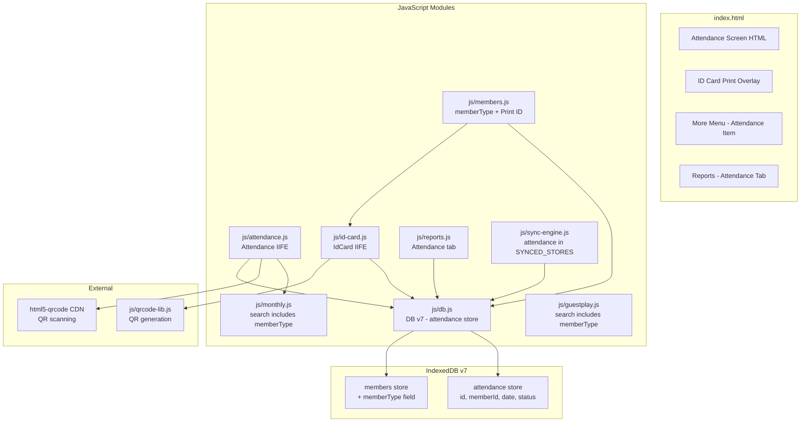

# Design Document: Member Attendance

## Overview

This design extends the Track Your Fitness PWA with member classification, ID card generation, daily attendance tracking, and attendance reporting. The feature adds a `memberType` field to member records, introduces two new JavaScript modules (`attendance.js` and `id-card.js`), upgrades the IndexedDB schema from version 6 to 7, and integrates QR-based attendance scanning using the `html5-qrcode` CDN library.

All new code follows the existing IIFE module pattern, uses vanilla JS (no build tools), and integrates with the existing navigation, search, and sync systems.

## Architecture



### Key Design Decisions

1. **DB Version 7**: A new `attendance` object store is added. The `memberType` field is added to member records as a non-indexed optional field (defaulting to "Regular" on creation). No index is needed since memberType is searched via in-memory filtering, matching the existing search pattern.

2. **Dynamic CDN Loading for html5-qrcode**: The library is loaded on-demand only when the user activates QR scanning, following the same pattern used for Firebase SDK loading in `sync-engine.js`. This avoids adding payload to initial load.

3. **Upsert Pattern for Attendance Records**: The composite unique index `['memberId', 'date']` enforces one record per member per day. The save function uses a get-then-put pattern: look up by composite index, if found update the existing record's status, otherwise insert a new record.

4. **ID Card as Print Overlay**: Rather than navigating to a new page, the ID card is rendered into a hidden overlay div. CSS `@media print` rules hide everything except the card content, ensuring clean printing.

## Components and Interfaces

### New Module: `js/attendance.js` (Attendance IIFE)

```javascript
const Attendance = (function () {
  'use strict';

  // Public API
  return {
    init,              // Called on app startup, binds event listeners
    renderAttendance   // Renders the attendance list for the selected date
  };
})();
```

**Internal Functions:**
- `init()` — Binds date picker change, search input, Select All toggle, Copy from Yesterday button, Scan QR button
- `renderAttendance()` — Loads active members, loads existing attendance records for selected date, renders checkboxes with pre-checked state
- `handleCheckboxChange(memberId, checked)` — Saves attendance record with status 'present' or 'absent'
- `handleSelectAll(checked)` — Iterates all visible checkboxes, sets state, saves records
- `handleCopyFromYesterday()` — Gets previous day's 'present' records, applies them to selected date
- `startQRScanner()` — Dynamically loads html5-qrcode CDN if not loaded, creates Html5QrcodeScanner instance
- `handleQRScanSuccess(decodedText)` — Looks up member by ID, saves attendance, shows confirmation with balance
- `stopQRScanner()` — Stops and clears scanner instance

### New Module: `js/id-card.js` (IdCard IIFE)

```javascript
const IdCard = (function () {
  'use strict';

  // Public API
  return {
    generate,  // Generates and shows printable ID card for a member
    hide       // Hides the ID card overlay
  };
})();
```

**Internal Functions:**
- `generate(member)` — Builds ID card HTML with member data and QR code, shows overlay
- `renderQR(container, memberId)` — Uses QRCode constructor from qrcode-lib.js to encode member ID
- `hide()` — Hides the print overlay
- `triggerPrint()` — Calls `window.print()` after a short delay for QR rendering

### Modified Module: `js/db.js`

New version: **DB_VERSION = 7**

**New object store in onupgradeneeded:**
```javascript
// v7: attendance store
if (!database.objectStoreNames.contains('attendance')) {
  const as = database.createObjectStore('attendance', { keyPath: 'id' });
  as.createIndex('memberId', 'memberId', { unique: false });
  as.createIndex('date', 'date', { unique: false });
  as.createIndex('memberDate', ['memberId', 'date'], { unique: true });
}
```

**New CRUD functions:**
- `addAttendance(record)` — Adds a new attendance record
- `getAttendance(id)` — Gets attendance by ID
- `getAllAttendance()` — Gets all attendance records
- `updateAttendance(record)` — Updates (puts) an attendance record
- `deleteAttendance(id)` — Deletes an attendance record
- `getAttendanceByMember(memberId)` — Cursor collect by memberId index
- `getAttendanceByDate(date)` — Cursor collect by date index
- `getAttendanceByMemberDate(memberId, date)` — Gets single record by composite index
- `getAttendanceByDateRange(startDate, endDate)` — Cursor collect by date range
- `saveAttendance(memberId, date, status)` — Upsert: gets by memberDate, updates or creates
- `deleteAttendanceByMember(memberId)` — Cascade delete helper

**Member record change:**
- When creating a new member, if `memberType` is not provided, default to `"Regular"`
- No schema migration needed for existing members — the field is optional and will read as `undefined` (handled gracefully in UI as empty or defaulted)

### Modified Module: `js/members.js`

Changes:
1. **Form handling**: Read `member-type` input value on submit, store as `member.memberType`
2. **Edit form**: Populate `member-type` input with existing `m.memberType` value
3. **Default value**: Set `memberType: memberType || 'Regular'` on new member creation
4. **Search filter**: Update `renderMemberList` filter to match against `m.memberType` in addition to `m.name`
5. **Print ID button**: Add a "Print ID" button in member card actions, calling `IdCard.generate(member)`
6. **Export/Import**: Add memberType to CSV columns

### Modified Module: `js/monthly.js`

Changes:
1. **Search filter**: In `renderMonthlyList`, update the search filter to also match against `m.memberType`:
   ```javascript
   members = members.filter(function (m) {
     return m.name.toLowerCase().indexOf(searchTerm) !== -1 ||
            (m.memberType && m.memberType.toLowerCase().indexOf(searchTerm) !== -1);
   });
   ```

### Modified Module: `js/guestplay.js`

Changes:
1. **Search filter**: In `renderGuestList`, update the search filter to also match against `m.memberType`:
   ```javascript
   members = members.filter(function (m) {
     return m.name.toLowerCase().indexOf(searchTerm) !== -1 ||
            (m.memberType && m.memberType.toLowerCase().indexOf(searchTerm) !== -1) ||
            (m.notes && m.notes.toLowerCase().indexOf(searchTerm) !== -1);
   });
   ```

### Modified Module: `js/reports.js`

Changes:
1. **New tab**: Add `'attendance'` to the tab switching logic
2. **New render function**: `renderAttendanceReport()` — queries attendance records by date range, aggregates per-member counts, sorts descending, renders expandable rows
3. **Search**: Filter by member name or memberType

### Modified Module: `js/sync-engine.js`

Changes:
1. Add `'attendance'` to the `SYNCED_STORES` array
2. Add `attendance` entry to `STORE_METHOD_MAP`:
   ```javascript
   attendance: { getAll: 'getAllAttendance', update: 'updateAttendance', delete: 'deleteAttendance' }
   ```

### Modified: `js/members.js` `deleteMemberCascade` (via db.js)

Add `deleteAttendanceByMember(memberId)` to the cascade delete flow in `DB.deleteMemberCascade`.

## Data Models

### Attendance Record

```javascript
{
  id: String,           // UUID generated by DB.generateId()
  memberId: String,     // Foreign key to members.id
  date: String,         // ISO date string "YYYY-MM-DD"
  status: String        // 'present' | 'absent'
}
```

**Indexes:**
| Index Name | Key Path | Unique |
|---|---|---|
| memberId | memberId | false |
| date | date | false |
| memberDate | ['memberId', 'date'] | true |

### Updated Member Record

```javascript
{
  id: String,           // UUID
  name: String,         // Member name (unique index)
  mobile: String,       // 10-digit mobile number
  notes: String,        // Free-text notes
  status: String,       // 'active' | 'inactive'
  memberType: String,   // 'Regular' | 'Coaching' | 'Other' | custom text
  createdAt: String     // ISO timestamp
}
```

The `memberType` field is additive — existing records without it are treated as having an empty/undefined memberType in the UI. New members default to `"Regular"`.

### ID Card Data Structure (transient, not stored)

```javascript
{
  name: String,
  mobile: String,
  memberType: String,
  notes: String,
  memberId: String,     // Used for QR code content
  qrData: String        // The member ID encoded in the QR code
}
```

## Correctness Properties

*A property is a characteristic or behavior that should hold true across all valid executions of a system — essentially, a formal statement about what the system should do. Properties serve as the bridge between human-readable specifications and machine-verifiable correctness guarantees.*

### Property 1: Member type default assignment

*For any* new member record created without an explicit memberType value, the stored memberType field SHALL equal "Regular".

**Validates: Requirements 1.3**

### Property 2: Member type round-trip persistence

*For any* valid memberType string value, storing it in a member record and then reading that record back SHALL yield the same memberType value.

**Validates: Requirements 1.4, 1.5**

### Property 3: Search filter correctness

*For any* set of members and any search term, the filtered result set SHALL contain exactly those members where either the name or the memberType contains the search term as a case-insensitive substring.

**Validates: Requirements 2.1, 2.2, 2.3, 2.4**

### Property 4: ID card content completeness

*For any* member record with non-empty name, mobile, memberType, and id fields, the generated ID card HTML SHALL contain all four of those values as visible text content.

**Validates: Requirements 3.2**

### Property 5: QR code encodes member ID

*For any* member ID string, the QR code generated for the ID card SHALL encode exactly that member ID string (verifiable by decoding).

**Validates: Requirements 3.3**

### Property 6: Attendance record upsert idempotence

*For any* memberId and date, saving an attendance record N times (N >= 1) with the same status SHALL result in exactly one attendance record for that memberId+date combination.

**Validates: Requirements 4.3**

### Property 7: Attendance record schema validity

*For any* saved attendance record, it SHALL contain fields id (non-empty string), memberId (non-empty string), date (matching YYYY-MM-DD format), and status (either 'present' or 'absent').

**Validates: Requirements 4.4**

### Property 8: Attendance checkbox state reflects stored records

*For any* date with existing attendance records, when the attendance screen renders, members with status 'present' SHALL have checked checkboxes and members with status 'absent' SHALL have unchecked checkboxes.

**Validates: Requirements 5.7**

### Property 9: Check/uncheck saves correct status

*For any* member and date, checking the attendance checkbox SHALL produce a stored record with status 'present', and unchecking SHALL produce a stored record with status 'absent'.

**Validates: Requirements 5.4, 5.5**

### Property 10: Select All toggles all members

*For any* set of displayed members, activating Select All SHALL set all attendance records to 'present', and deactivating SHALL set all to 'absent'.

**Validates: Requirements 5.6**

### Property 11: Copy from yesterday retrieves correct members

*For any* selected date D, the "Copy from yesterday" operation SHALL mark exactly those members as 'present' on date D who had status 'present' on date D-1.

**Validates: Requirements 6.2, 6.3**

### Property 12: QR scan marks member present

*For any* valid member ID scanned via QR code, the system SHALL save an attendance record with status 'present' for that member and today's date.

**Validates: Requirements 7.3, 7.4**

### Property 13: Attendance report count accuracy

*For any* date range and set of attendance records, the report SHALL display each member's count as the exact number of days they were marked 'present' within that range.

**Validates: Requirements 8.3**

### Property 14: Attendance report sort order

*For any* attendance report output with multiple members, the list SHALL be sorted such that each member's attendance count is greater than or equal to the next member's count (descending order).

**Validates: Requirements 8.4**

### Property 15: Attendance report detail expansion

*For any* member in the attendance report, expanding their row SHALL show exactly the dates on which they were marked 'present' within the selected range.

**Validates: Requirements 8.5**

## Error Handling

| Scenario | Handling |
|---|---|
| Camera permission denied | Display inline message: "Camera access is required for QR scanning". Hide scanner UI. |
| QR code contains non-existent member ID | Display inline error: "Member not found". Keep scanner active for retry. |
| IndexedDB write fails (attendance save) | Show alert with error message. Do not change checkbox state. |
| html5-qrcode CDN fails to load | Display message: "QR scanner could not be loaded. Check your internet connection." |
| No attendance records for previous day (Copy from Yesterday) | Display notification: "No attendance records found for the previous day" |
| Member record has no memberType (legacy data) | Treat as empty string in search matching, display nothing in UI for type badge |
| Attendance store upgrade fails | IndexedDB handles this via transaction abort; user sees "Failed to open database" on next load |
| Print triggered before QR renders | Use `setTimeout(window.print, 300)` to allow QR canvas to complete |

## Testing Strategy

### Unit Tests (Example-Based)

Unit tests cover specific scenarios, edge cases, and UI integration points:

- **DB Schema**: Verify attendance store exists with correct keyPath and indexes after v7 upgrade
- **Default memberType**: Creating a member without type yields "Regular"
- **Edit form population**: Opening edit pre-fills memberType field
- **Search edge cases**: Empty search returns all members; search with special characters doesn't crash
- **ID card rendering**: Verify all fields appear in generated HTML
- **Copy from Yesterday with no data**: Verify notification message
- **QR scan with invalid ID**: Verify "Member not found" message
- **Camera denied**: Verify error message shown
- **Report with no data**: Verify empty state message
- **Select All with zero members**: No errors thrown

### Property-Based Tests

Property-based tests validate universal properties using randomized inputs. Use [fast-check](https://github.com/dubzzz/fast-check) as the PBT library.

**Configuration:**
- Minimum 100 iterations per property test
- Each test tagged with: **Feature: member-attendance, Property {number}: {property_text}**

**Properties to implement:**

1. **Property 1** — Generate random member objects without memberType; verify stored value is always "Regular"
2. **Property 2** — Generate random memberType strings; store and read back; verify equality
3. **Property 3** — Generate random member lists and search terms; verify filter output matches expected set
4. **Property 4** — Generate random member data; verify ID card HTML contains all required fields
5. **Property 5** — Generate random UUID strings; encode as QR; decode and verify equality
6. **Property 6** — Generate random memberId+date pairs; save N times; verify exactly 1 record exists
7. **Property 7** — Generate and save random attendance records; read back; verify schema
8. **Property 8** — Generate random attendance states; render; verify checkbox states match
9. **Property 9** — Generate random check/uncheck actions; verify stored status matches action
10. **Property 10** — Generate random member sets; toggle Select All; verify all records match
11. **Property 11** — Generate random yesterday attendance; run copy; verify today matches yesterday's present set
12. **Property 12** — Generate random valid member IDs; simulate QR scan; verify present record saved
13. **Property 13** — Generate random attendance data and date ranges; verify report counts
14. **Property 14** — Generate random report data; verify descending sort
15. **Property 15** — Generate random member attendance; expand; verify dates shown match records

### Integration Tests

- Full flow: Add member with type -> search by type -> verify found on all screens
- Full flow: Mark attendance -> change date -> verify pre-checked state
- Full flow: Copy from yesterday -> verify records created
- Full flow: Generate ID card -> scan QR code value -> verify member lookup succeeds
- Full flow: Attendance report shows correct counts after marking members over multiple days
- Sync: Verify attendance records sync to/from Firestore when sync is configured
