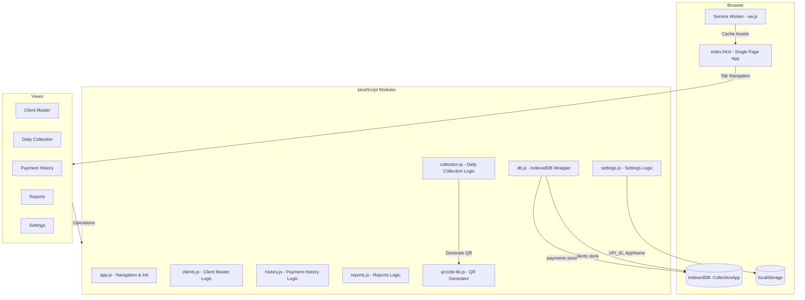
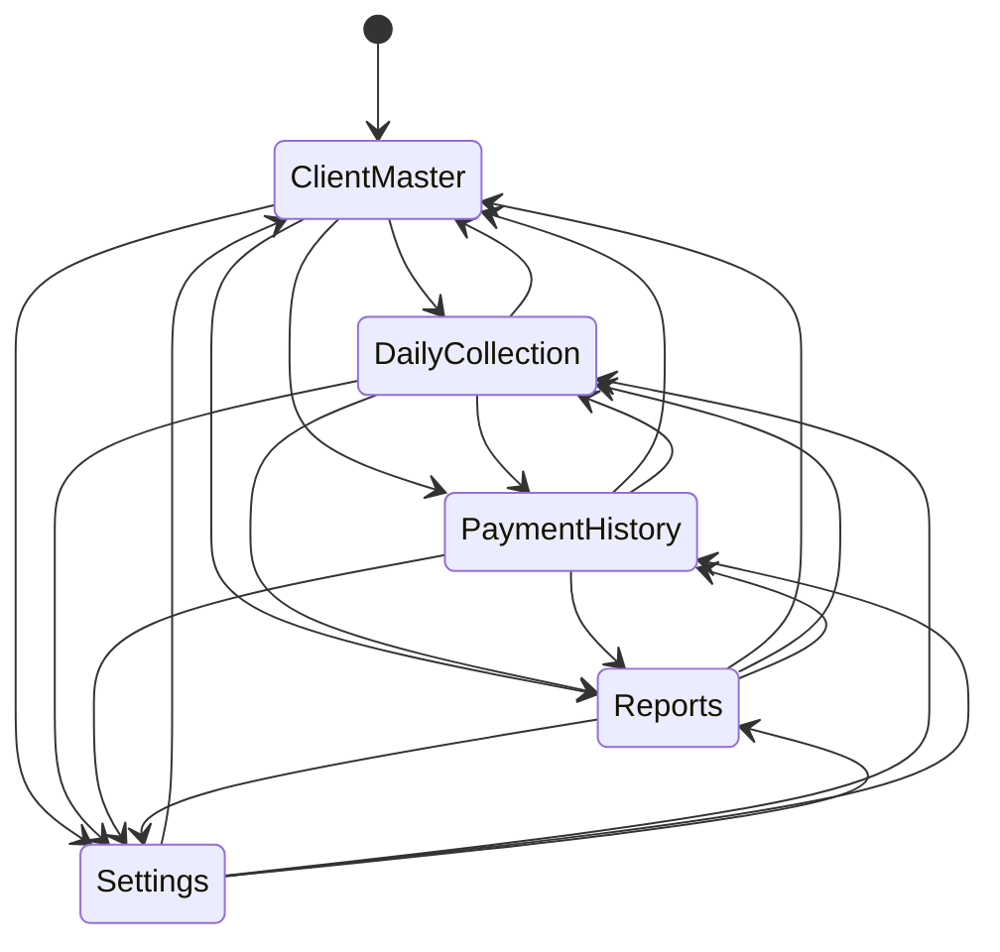

# Design Document: Debt Collection PWA

## Overview

The Debt Collection PWA is a client-side Progressive Web Application for managing personal debt collection operations. It enables collectors to register clients with their borrowing details, track daily EMI payments via UPI QR codes, and generate reports on collection progress. The app operates entirely offline using IndexedDB for structured data and localStorage for simple settings, with no backend server required.

The application follows the same architectural patterns as the existing ABC_Store PWA in the workspace: a single `index.html` with tab-based navigation, separate CSS and JavaScript module files, a Service Worker for offline/PWA support, and the qrcode-generator library by Kazuhiko Arase for UPI QR code generation.

**Key Design Decisions:**
- **Vanilla HTML/CSS/JS** — no frameworks, keeping the app lightweight and simple
- **IndexedDB** for clients and payments (structured, queryable data)
- **localStorage** for settings (simple key-value: UPI_ID, AppName)
- **Single-page app** with tab-based navigation (no routing library)
- **Mobile-first responsive design** with bottom navigation bar
- **Offline-first** — all operations work without network connectivity

## Architecture



### File Structure

```
Collection_App/
├── index.html              # Single-page app shell
├── manifest.json           # PWA manifest
├── sw.js                   # Service Worker
├── css/
│   └── styles.css          # All styles (mobile-first)
├── js/
│   ├── app.js              # App init, navigation, SW registration
│   ├── db.js               # IndexedDB wrapper (clients + payments)
│   ├── clients.js          # Client Master CRUD logic
│   ├── collection.js       # Daily Collection + QR payment logic
│   ├── history.js          # Payment History filtering/display
│   ├── reports.js          # Day-wise & Client-wise reports + print
│   ├── settings.js         # UPI_ID & AppName management
│   └── qrcode-lib.js       # qrcode-generator by Kazuhiko Arase
└── icons/
    ├── icon-192.png        # PWA icon 192x192
    └── icon-512.png        # PWA icon 512x512
```

### Navigation Flow

The app uses a bottom navigation bar with 5 tabs. Each tab shows/hides a `<section>` element. The active tab is tracked via CSS classes and `aria-current` attributes.



## Components and Interfaces

### 1. db.js — IndexedDB Wrapper

A revealing module pattern (IIFE) exposing a global `DB` object. Manages the `CollectionApp` database with two object stores.

```javascript
const DB = (function() {
  // Database: "CollectionApp", version 1
  // Object Stores:
  //   - clients: keyPath "id", indexes on "name" (unique) and "mobile"
  //   - payments: keyPath "id", indexes on "clientId" and "date"

  return {
    init(),                          // Open/create database
    addClient(client),               // Add new client record
    getClient(id),                   // Get client by ID
    getAllClients(),                  // Get all clients
    updateClient(client),            // Update existing client
    deleteClient(id),                // Delete client by ID
    addPayment(payment),             // Add payment record
    getPaymentsByClient(clientId),   // Get all payments for a client
    getPaymentsByDateRange(start, end), // Get payments in date range
    getPaymentsByClientAndDate(clientId, date), // Get payments for client on date
    deletePaymentsByClient(clientId),  // Delete all payments for a client
  };
})();
```

### 2. app.js — Application Controller

Handles initialization, tab navigation, service worker registration, and AppName management.

```javascript
// Public functions:
registerServiceWorker()     // Register sw.js
navigateToScreen(screenId)  // Show/hide sections, update nav
setupTabNavigation()        // Attach click handlers to nav tabs
updateAppName()             // Read AppName from localStorage, update header/title
initApp()                   // Main init: DB.init(), setup nav, init modules
```

### 3. clients.js — Client Master Module

IIFE exposing a global `ClientMaster` object for client CRUD operations.

```javascript
const ClientMaster = (function() {
  return {
    init(),                  // Set up event listeners, render client list
    renderClientList(),      // Fetch and display all clients
    showAddForm(),           // Show blank add form
    showEditForm(id),        // Show pre-filled edit form for client
    validateForm(data),      // Validate client form data, return errors[]
    saveClient(data),        // Add or update client in DB
    deleteClient(id),        // Confirm & delete client + payments
    calculateEMI(amount, duration),  // amount / duration, rounded to 2dp
    calculateEndDate(startDate, duration),  // startDate + duration days
  };
})();
```

### 4. collection.js — Daily Collection Module

IIFE exposing a global `Collection` object for daily payment collection.

```javascript
const Collection = (function() {
  return {
    init(),                      // Set up date selector, render collection list
    renderCollectionList(date),  // Show clients with pending amounts for date
    showPaymentPage(clientId, amount),  // Show QR code + payment confirmation
    generateQRCode(upiId, appName, amount, clientName), // Generate UPI QR
    confirmPayment(clientId, date, amount),  // Record payment in DB
    calculatePending(client),    // totalAmount - sum(payments)
  };
})();
```

### 5. history.js — Payment History Module

IIFE exposing a global `PaymentHistory` object.

```javascript
const PaymentHistory = (function() {
  return {
    init(),                          // Set up date filters with defaults
    loadAndRenderHistory(),          // Fetch & display filtered payments
    validateDateRange(start, end),   // Ensure start <= end
  };
})();
```

### 6. reports.js — Reports Module

IIFE exposing a global `Reports` object.

```javascript
const Reports = (function() {
  return {
    init(),                          // Set up date range, report type tabs
    generateDayWiseReport(start, end),    // Aggregate by date
    generateClientWiseReport(start, end), // Aggregate by client
    renderReport(data, type),        // Display report table
    printReport(),                   // Trigger browser print with styled layout
  };
})();
```

### 7. settings.js — Settings Module

IIFE exposing a global `Settings` object. Uses localStorage for persistence.

```javascript
const Settings = (function() {
  const KEYS = { UPI_ID: 'upi_id', APP_NAME: 'app_name' };
  const DEFAULTS = { APP_NAME: 'ABC Debt Collection' };

  return {
    init(),              // Load settings into form fields
    save(),              // Validate & persist to localStorage
    getUpiId(),          // Return stored UPI_ID or null
    getAppName(),        // Return stored AppName or default
  };
})();
```

### 8. qrcode-lib.js — QR Code Generator

The qrcode-generator library by Kazuhiko Arase, included as a local file. Provides `qrcode(typeNumber, errorCorrectionLevel)` factory function.

## Data Models

### Client Record (IndexedDB: `clients` store)

| Field | Type | Constraints | Description |
|-------|------|-------------|-------------|
| id | string | Primary key (UUID) | Unique identifier |
| name | string | Max 100 chars, unique (case-insensitive, trimmed) | Client name |
| mobile | string | Exactly 10 digits | Mobile number |
| totalAmount | number | 0.01 to 9999999.99 | Total borrowed amount |
| startDate | string | ISO date (YYYY-MM-DD) | Collection start date |
| duration | number | 1 to 999 | Duration in days |
| emi | number | > 0, 2 decimal places | Daily installment amount |
| endDate | string | ISO date (YYYY-MM-DD) | Calculated: startDate + duration |
| createdAt | string | ISO datetime | Record creation timestamp |

**Indexes:**
- `name` — unique index for duplicate detection
- `mobile` — non-unique index for search

### Payment Record (IndexedDB: `payments` store)

| Field | Type | Constraints | Description |
|-------|------|-------------|-------------|
| id | string | Primary key (UUID) | Unique identifier |
| clientId | string | Foreign key to clients.id | Associated client |
| date | string | ISO date (YYYY-MM-DD) | Payment date |
| amount | number | > 0 | Amount collected |
| createdAt | string | ISO datetime | Record creation timestamp |

**Indexes:**
- `clientId` — for querying payments by client
- `date` — for date-range queries and sorting

### Settings (localStorage)

| Key | Type | Default | Description |
|-----|------|---------|-------------|
| `upi_id` | string | null | UPI ID in format `username@provider` |
| `app_name` | string | "ABC Debt Collection" | Application display name |

### Derived Calculations

- **EMI** = `totalAmount / duration`, rounded to 2 decimal places
- **End Date** = `startDate + duration` days
- **Pending Amount** = `totalAmount - sum(all payments for client)`
- **UPI Link** = `upi://pay?pa=<UPI_ID>&pn=<AppName>&am=<AMOUNT>&cu=INR&tn=<CLIENT_NAME>`


## Correctness Properties

*A property is a characteristic or behavior that should hold true across all valid executions of a system — essentially, a formal statement about what the system should do. Properties serve as the bridge between human-readable specifications and machine-verifiable correctness guarantees.*

### Property 1: EMI Calculation Correctness

*For any* valid total borrowed amount (0.01 to 9,999,999.99) and duration (1 to 999 days), the calculated EMI SHALL equal the total borrowed amount divided by duration, rounded to exactly 2 decimal places.

**Validates: Requirements 1.4, 2.4**

### Property 2: End Date Calculation Correctness

*For any* valid collection start date and duration (1 to 999 days), the calculated end date SHALL equal the start date plus duration calendar days.

**Validates: Requirements 1.5, 2.4**

### Property 3: Client Name Uniqueness Enforcement

*For any* set of existing client records, attempting to add or update a client record with a name that matches an existing record's name (after trimming whitespace and comparing case-insensitively) SHALL be rejected, unless the match is against the record being edited itself.

**Validates: Requirements 1.2, 2.2, 13.5**

### Property 4: Pending Amount Calculation

*For any* client with a total borrowed amount and any sequence of recorded payments, the pending amount SHALL equal the total borrowed amount minus the sum of all payment amounts for that client.

**Validates: Requirements 7.4**

### Property 5: UPI Payment Link Format

*For any* valid UPI_ID, AppName, payment amount (> 0, formatted to 2 decimal places), and client name, the generated UPI payment link SHALL be exactly `upi://pay?pa=<UPI_ID>&pn=<AppName>&am=<AMOUNT>&cu=INR&tn=<CLIENT_NAME>`.

**Validates: Requirements 5.2, 10.5**

### Property 6: Payment Recording Round-Trip

*For any* valid payment (positive amount, valid client ID, valid date), after confirming the payment, querying payments for that client SHALL return a record containing the exact client ID, date, and amount that was submitted.

**Validates: Requirements 7.2, 7.3**

### Property 7: Daily Collection List Filtering

*For any* set of clients with various payment histories, the daily collection list SHALL contain exactly those clients whose total borrowed amount exceeds their total payments (pending > 0), sorted alphabetically by client name.

**Validates: Requirements 6.2, 6.6**

### Property 8: Payment History Date Range Filtering

*For any* set of payment records and any valid date range (start <= end), the filtered results SHALL contain exactly those payments with a date on or after start and on or before end, sorted by date descending.

**Validates: Requirements 8.2, 9.4**

### Property 9: Day-Wise Report Aggregation

*For any* set of payment records within a date range, the day-wise report SHALL show each unique date with a total equal to the sum of all payment amounts on that date, sorted in reverse chronological order.

**Validates: Requirements 9.2**

### Property 10: Client-Wise Report Aggregation

*For any* set of payment records within a date range, the client-wise report SHALL show each unique client with a total equal to the sum of all payment amounts for that client, sorted alphabetically by client name.

**Validates: Requirements 9.3**

### Property 11: Mandatory Field Validation

*For any* client form submission where one or more mandatory fields (Client Name, mobile number, total borrowed amount, collection start date) are empty or whitespace-only, the system SHALL reject the submission and identify the specific missing fields.

**Validates: Requirements 1.7, 13.1**

### Property 12: Mobile Number Validation

*For any* string that is not exactly 10 numeric digits, the client form validation SHALL reject it as an invalid mobile number.

**Validates: Requirements 13.4**

### Property 13: Amount Validation (Client)

*For any* total borrowed amount that is zero or negative, the client form validation SHALL reject the submission.

**Validates: Requirements 13.2**

### Property 14: Duration Validation

*For any* duration value that is zero or negative, the client form validation SHALL reject the submission.

**Validates: Requirements 13.3**

### Property 15: Payment Amount Validation

*For any* payment amount that is zero or negative, the payment confirmation SHALL be rejected.

**Validates: Requirements 7.5**

### Property 16: Collection Amount Bounds

*For any* client in the daily collection list, the editable payment amount SHALL be accepted only if it is between 1 and the client's current pending amount (inclusive).

**Validates: Requirements 6.4**

### Property 17: Date Range Validation

*For any* date range where the start date is after the end date, the system SHALL reject the filter and display a validation error.

**Validates: Requirements 8.4**

### Property 18: Settings Persistence Round-Trip

*For any* valid UPI_ID (matching `username@provider` format, max 45 characters) and AppName (max 50 characters), saving then loading settings SHALL return the exact same values that were saved.

**Validates: Requirements 4.6**

### Property 19: Whitespace UPI_ID Rejection

*For any* string composed entirely of whitespace characters (or empty), attempting to save it as UPI_ID SHALL be rejected without persisting.

**Validates: Requirements 4.4**

### Property 20: Client Deletion Cascades to Payments

*For any* client with any number of associated payment records, deleting the client SHALL also remove all payment records associated with that client's ID from storage.

**Validates: Requirements 3.2**

### Property 21: Form State Preservation on Validation Error

*For any* client form submission that fails validation, all field values entered by the collector SHALL remain unchanged in the form after the validation error is displayed.

**Validates: Requirements 13.6**

## Error Handling

### Storage Errors

| Error Scenario | Handling Strategy |
|---------------|-------------------|
| IndexedDB unavailable | Display persistent error banner: "Local storage not available. App cannot function." |
| Quota exceeded | Display error: "Device storage is full. Please free space to continue." Preserve existing data. |
| Write failure (client/payment) | Display inline error near the action button. Do not clear form data. Do not update UI state. |
| Read failure | Display inline error: "Could not load data. Please try again." Offer retry button. |

### Validation Errors

| Error Scenario | Handling Strategy |
|---------------|-------------------|
| Empty mandatory field | Highlight field border red, show error text adjacent to field |
| Duplicate client name | Show error message below name field: "Client name already exists" |
| Invalid mobile format | Show error below mobile field: "Enter exactly 10 digits" |
| Invalid amount (≤ 0) | Show error below amount field: "Amount must be greater than zero" |
| Invalid duration (≤ 0) | Show error below duration field: "Duration must be at least 1 day" |
| Invalid date range | Show error: "Start date cannot be after end date" |
| Missing UPI_ID for collection | Show modal/alert: "Please configure UPI ID in Settings first" |

### QR Code Errors

| Error Scenario | Handling Strategy |
|---------------|-------------------|
| QR generation fails | Hide QR container, show UPI link as tappable `<a>` element with `href="upi://pay?..."` |
| Invalid UPI_ID format | Prevent QR generation, show error directing to Settings |

### Service Worker Errors

| Error Scenario | Handling Strategy |
|---------------|-------------------|
| SW registration failure | Log to console, app continues without offline support |
| Cache installation failure | Do not activate SW, retry on next page load |
| Cache update available | Show non-intrusive notification: "Update available. Restart app to apply." |

### Error Display Patterns

1. **Inline errors** — adjacent to the relevant form field, styled in red
2. **Toast messages** — 3-second auto-dismissing notifications for successful saves
3. **Modal/alert** — for critical errors requiring acknowledgment (e.g., missing UPI_ID, deletion confirmation)
4. **Console logging** — all errors logged for debugging, never shown to user as raw error objects

## Testing Strategy

### Unit Tests (Example-Based)

Focus on specific scenarios and edge cases:
- Default values (Duration = 100, AppName = "ABC Debt Collection")
- Form population on edit (all fields correctly loaded)
- UI state transitions (tab navigation, form show/hide)
- Print layout (correct elements shown/hidden)
- Confirmation dialogs (cancel retains data)
- Empty states (no clients, no payments)
- Date defaults (current date for collection, last 30 days for history)

### Property-Based Tests

**Library:** [fast-check](https://github.com/dubzzz/fast-check) (JavaScript property-based testing)

**Configuration:**
- Minimum 100 iterations per property test
- Each test tagged with: `Feature: debt-collection-pwa, Property {N}: {description}`

**Properties to implement:**
1. EMI calculation: `∀ amount ∈ [0.01, 9999999.99], duration ∈ [1, 999]: EMI = round(amount/duration, 2)`
2. End date calculation: `∀ startDate, duration: endDate = startDate + duration days`
3. Name uniqueness: `∀ names with same normalized form: reject duplicate`
4. Pending amount: `∀ client, payments[]: pending = total - sum(payments)`
5. UPI link format: `∀ valid params: link matches exact format`
6. Payment round-trip: `∀ payment: save then query returns same data`
7. Collection list filtering: `∀ clients[]: list = filter(pending > 0).sort(name)`
8. Date range filtering: `∀ payments[], range: result = filter(in range).sort(date desc)`
9. Day-wise aggregation: `∀ payments[]: each date total = sum(amounts on that date)`
10. Client-wise aggregation: `∀ payments[]: each client total = sum(amounts for client)`
11. Mandatory field validation: `∀ missing fields: reject and identify`
12. Mobile validation: `∀ non-10-digit strings: reject`
13. Amount validation (client): `∀ amount ≤ 0: reject`
14. Duration validation: `∀ duration ≤ 0: reject`
15. Payment amount validation: `∀ amount ≤ 0: reject`
16. Collection amount bounds: `∀ amount ∉ [1, pending]: reject`
17. Date range validation: `∀ start > end: reject`
18. Settings round-trip: `∀ valid settings: save then load = same`
19. Whitespace UPI rejection: `∀ whitespace string: reject`
20. Deletion cascade: `∀ client + payments: delete removes all`
21. Form preservation: `∀ form with validation error: fields unchanged`

### Integration Tests

- IndexedDB persistence across simulated sessions
- Service Worker caching of all assets
- Browser print dialog invocation
- QR code library integration (render actual QR)

### Manual/Visual Testing

- Mobile responsiveness across viewport sizes
- PWA installation flow on Android/iOS
- Offline operation after going airplane mode
- Print layout appearance
